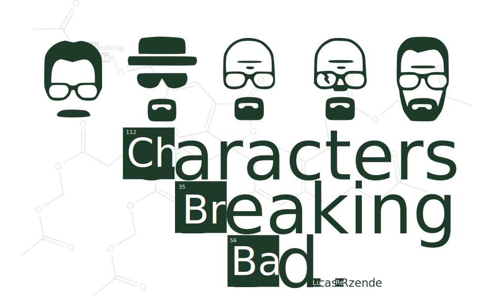

<h1> Breaking Bad APP </h1>

<h2> ⚙️Pré-requisitos:</h2>
- Node.js -> site de download: <a href="https://nodejs.org/pt-br/download/">Node.js</a>
- Npm

<h2> ⚙️Passo a passo:</h2>
Primeiro, execute o servidor de desenvolvimento:

```bash
npm run dev
# or
yarn dev
```

Abra [http://localhost:3000](http://localhost:3000) com seu navegador para ver o resultado.

<h2> 💻Tecnologias usadas:</h4>
<ul>
    <li>Html5</li>
    <li>CSS3/Sass</li>
    <li>Javascript/TypeScript</li>
    <li>ReactJS</li>
    <li>Next.js</li>
</ul>

<h2>🧪 Funcionalidades:</h2>

<p>A tela lista todos os personagens do seriado <strong>Breaking Bad</strong> de forma a parecer com uma <strong>Tabela Periódica</strong>. Caso seja escolhido um personagem será retornado as informações do mesmo. As informações mostradas são:
    <ul>
        <li>Nome</li>
        <li>Data de Nascimento</li>
        <li>Ocupação</li>
        <li>Imagem do personagem</li>
        <li>Status (vivo ou morto)</li>
        <li>Apelido</li>
        <li>Ator que interpretou o personagem</li>
    </ul>
</p>

Todas informações foram buscadas da API: <a href="https://www.breakingbadapi.com/"> The Breaking Bad API</a>


<h2>🌵Outras informações: </h2>

<h4>🧰 Ferramentas usadas para prototipação e criação dos icones:</h4>
<ul>
    <li>Figma</li>
    <li>Adobe Illustrator</li>
    <li>Adobe Photoshop</li>
</ul>
<h4>🖌️ Paleta de cores usada: </h4>
<ul>
    <li> ⚪ Branco:	hex-> #ffffff | hsl-> hsl(0, 0%, 100%)</li>
    <li> ⚪ Cinza: hex-> #bfbfbf | hsl-> hsl(0, 0%, 75%)</li>
    <li> 🟢 Verde escuro: hex-> #1d392a | hsl-> hsl(146, 32%, 17%)</li>
    <li> 🟢 Verde claro: hex-> #40c480 | hsl-> hsl(149, 53%, 51%)</li>
    <li> 🔴 Vermelho: hex-> hex-> #f23f42 | hsl-> hsl(359, 87%, 60%)</li>
    <li> ⚫ Preto: hex-> #1d120c | hsl-> hsl(21, 41%, 8%)</li>
</ul>
