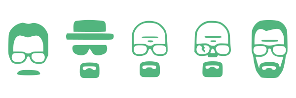

<h1> Breaking Bad Characters </h1>

<strong>🚐 Para visualizar o projeto clique aqui: <a href="https://breaking-bad-app-wine.vercel.app/">Characters Breaking Bad</a></strong>
<br><br>

<h2>🧪 Descrição:</h2>

<p>O projeto é uma tela que lista todos os personagens do seriado <strong>Breaking Bad</strong> de forma a parecer com uma <strong>Tabela Periódica</strong>. Caso seja escolhido um personagem será mostrado as informações do mesmo. Elas são:
    <ul>
        <li>Nome</li>
        <li>Data de Nascimento</li>
        <li>Ocupação</li>
        <li>Imagem do personagem</li>
        <li>Status (vivo ou morto)</li>
        <li>Apelido</li>
        <li>Ator que interpretou o personagem</li>
        <li>Temporadas que o personagem aparece</li>
    </ul>
</p>

<h2> 🚶Passo a passo:</h2>

Execute o servidor de desenvolvimento:

```bash
npm run dev
# ou
yarn dev
```

Abra [http://localhost:3000](http://localhost:3000) com seu navegador para ver o resultado.
<br><br>

<h2> 💻Tecnologias usadas:</h4>
<ul>
    <li>Html5</li>
    <li>CSS3/Sass</li>
    <li>Javascript/TypeScript</li>
    <li>ReactJS</li>
    <li>Next.js</li>
</ul>
<br><br>

Todas informações foram buscadas da API: <a href="https://www.breakingbadapi.com/"> The Breaking Bad API</a>

<h2> 🎥Demonstração:</h2>

<br><br>

<h2>🌵Outras informações: </h2>
<br>
<h4>🧰 Ferramentas usadas para prototipação e criação dos icones:</h4>
<ul>
    <li>Figma</li>
    <li>Adobe Illustrator</li>
    <li>Adobe Photoshop</li>
</ul>
<br>
<h4>🖌️ Paleta de cores usada: </h4>
<ul>
    <li> ⚪ Branco:	hex-> #ffffff | hsl-> hsl(0, 0%, 100%)</li>
    <li> ⚪ Cinza: hex-> #bfbfbf | hsl-> hsl(0, 0%, 75%)</li>
    <li> 🟢 Verde escuro: hex-> #1d392a | hsl-> hsl(146, 32%, 17%)</li>
    <li> 🟢 Verde claro: hex-> #40c480 | hsl-> hsl(149, 53%, 51%)</li>
    <li> 🔴 Vermelho: hex-> hex-> #f23f42 | hsl-> hsl(359, 87%, 60%)</li>
    <li> ⚫ Preto: hex-> #1d120c | hsl-> hsl(21, 41%, 8%)</li>
</ul>
